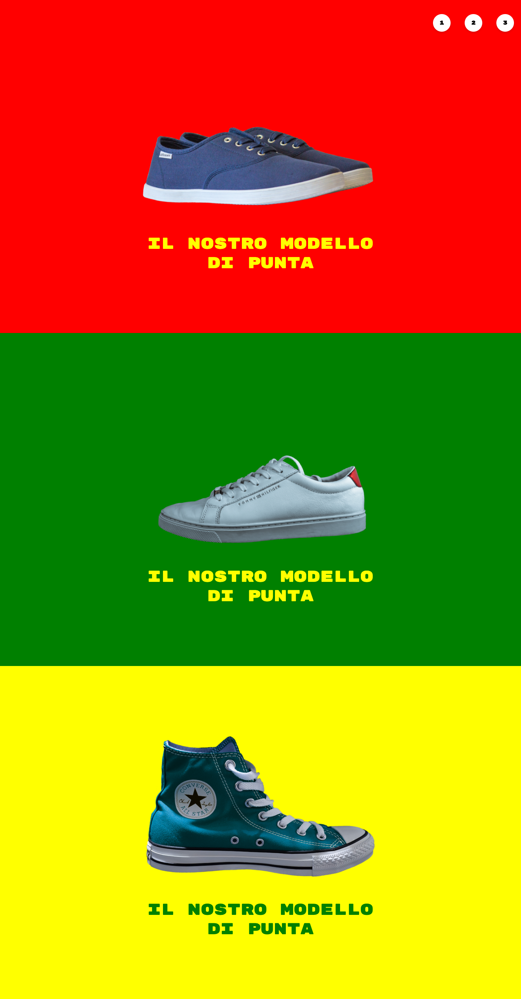

# Esercizio di oggi: Shoes:

## cartella/repo: **`htmlcss-shoes.`** 

>**`Descrizione:`** Riproduciamo il layout allegato. Ogni singolo blocco avrà l'altezza della viewport, il testo e l'immagine sono centrati rispetto al blocco. Cliccando sui numeri in alto a destra, la visualizzazione salta alla sezione corrispondente

>**`nota:`** font-family: 'Rubik Mono One', sans-serif;

### **`Consigli:`**   
Osservate bene le immagini originali in allegato per evitare eventuali grane.

### _**`Bonus:`**_

Nascondiamo la barra di navigazione all'utente e costringiamolo a navigare solo utilizzando i numerini in alto.

---

---